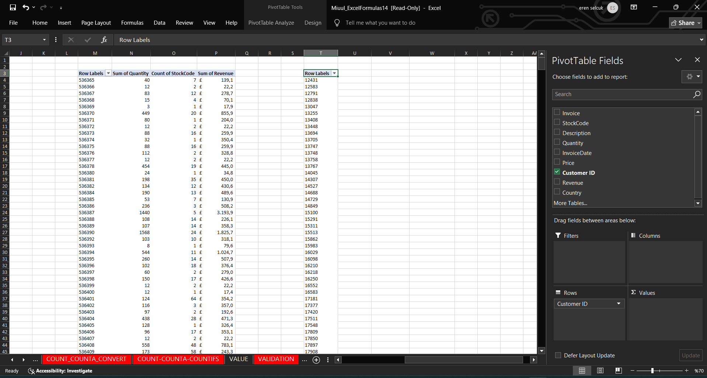

# excel-pivot-table
# 📊 Excel Pivot Table Project

This project demonstrates how to perform essential data analysis using **Pivot Tables** in Excel. Each step focuses on extracting valuable insights from an invoice-based sales dataset without using formulas manually—relying solely on the power of pivot tables.

---

## 1️⃣ Creating a Pivot Table

We create a pivot table by going to:

> **Insert → PivotTable → Existing Worksheet**

This allows us to analyze data directly on the current sheet.

📷 

---

## 2️⃣ Unique Invoice Numbers (No Duplicates)

We drag the `InvoiceNo` field into the **Rows** section. This gives us a list of invoice numbers **without duplicates** (i.e., uniquely).

📷 

---

## 3️⃣ Total Quantity per Invoice & Count of Items

- We drag `Quantity` into the **Values** section → summarized as **Sum of Quantity**.
- Additionally, we drag `StockCode` into the Values section and set it to **Count**, showing how many individual items were purchased on each invoice.

📷 

---

## 4️⃣ Total Revenue per Invoice

Using a calculated `Revenue` column in the dataset (e.g., `Quantity × UnitPrice`), we summarize it with **Sum of Revenue** to find total sales per invoice.

📷 

---

## 5️⃣ Unique Customer IDs

By dragging `CustomerID` to the **Rows** section, we list each customer uniquely.

📷 

---

## 7️ First Purchase Date per Customer

To find the **first purchase date** for each customer, we drag `InvoiceDate` to the Values section and summarize by **Min**. This tells us the date of their first transaction.

📷 

---

## 🔚 Conclusion

This exercise demonstrates:
- How to explore invoice-level and customer-level insights.
- How to use pivot tables to summarize data effectively without duplicates.
- Useful aggregations such as **Sum**, **Count**, and **Min** in practical business scenarios.

---
